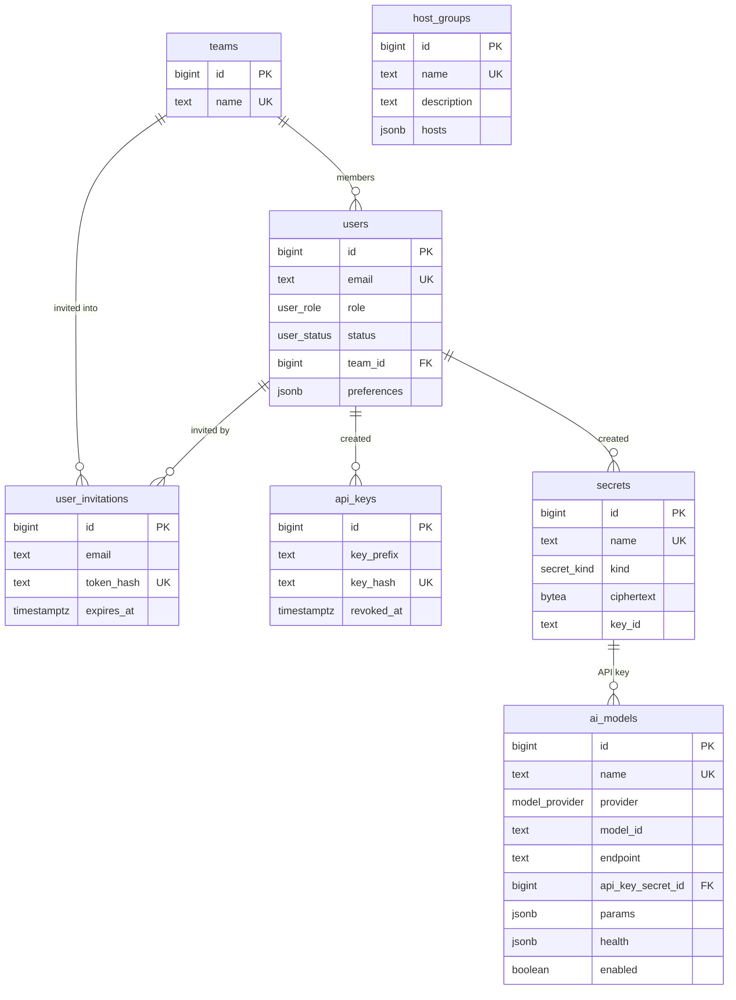
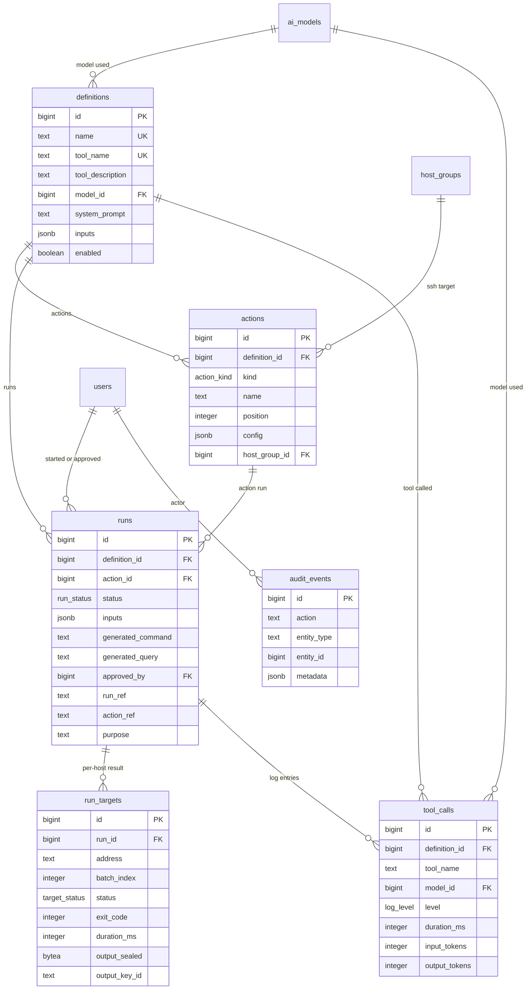
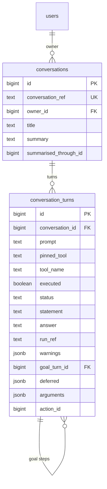

# MCP Gateway — the database schema

Executable DDL: [`schema.sql`](./schema.sql) · Liquibase changelog:
[`../db/changelog/`](../db/changelog/)

The panel's own guide (`PANEL.md`) lives in the `mcp-panel` repository.

**Target:** PostgreSQL 10 or later (`GENERATED … AS IDENTITY` arrived in that version).
**15 tables, 9 enums.** No stored procedures, no triggers.

> The panel is the **control plane** for the MCP server. The MCP server itself is a
> separate application (Python) and reads this schema:
>
> | MCP call | Source |
> |---|---|
> | `tools/list` | The `definitions` rows where `enabled = true` — `tool_name`, `tool_description`, and a JSON Schema built from `inputs` |
> | `tools/call` | That definition's `model_id`, `system_prompt` and `actions` rows |

**Sessions are not in this schema** — they live in Redis. The database holds only the
durable identity records (`users`, `user_invitations`, `api_keys`).

---

## The design rule: JSONB or a table?

There is one test:

| | Rule | Examples |
|---|---|---|
| **JSONB** | Configuration. Always read and written with its owner, changed all at once, never queried an element at a time. | Action settings, dynamic inputs, model parameters, group members, the values a run was given |
| **TABLE** | State that changes on its own, and records that accumulate. Rows are updated one at a time, or pile up and get queried. | Users, models, definitions, actions, run targets, call logs, the audit trail |

Applying it took the first draft from 28 tables to 13. Two more arrived later with the
console, bringing it to 15.

| Removed | Where it went |
|---|---|
| `action_rest`, `action_ssh`, `action_db` | `actions.config` |
| `action_rest_headers` | `actions.config.headers` |
| `action_ssh_hosts`, `action_ssh_allowed_commands`, `action_ssh_blocked_patterns` | arrays inside `actions.config` |
| `action_db_operations` | `actions.config.allowedOperations` |
| `definition_inputs`, `definition_input_options` | `definitions.inputs` |
| `hosts`, `host_group_members` | `host_groups.hosts` |
| `ai_model_health` | `ai_models.health` (the latest state) |
| `run_inputs` | `runs.inputs` |
| `sessions` | Redis |

### Primary keys

Every table has `id bigint GENERATED BY DEFAULT AS IDENTITY PRIMARY KEY`, and the foreign
keys are `bigint` too. `audit_events.entity_id` has no foreign key because it is a
polymorphic reference, but its type is the same.

`BY DEFAULT` rather than `ALWAYS`: a migration or a seed load has to be able to write an
explicit id, and `ALWAYS` refuses that without `OVERRIDING SYSTEM VALUE`.

On the Hibernate side:

```java
@Id
@GeneratedValue(strategy = GenerationType.IDENTITY)
private Long id;
```

> **The trade-off:** incrementing numbers are guessable. That is fine behind
> authentication, but if ids ever have to appear on a public surface — in an MCP tool
> response, say — they will need an opaque public id beside them. The real secrets are not
> in the ids anyway: an invitation link works through `user_invitations.token_hash`, an API
> key through `api_keys.key_hash`, and the cipher service will not hand over a secret on the
> strength of an id alone — it checks which action the call is for.

### No stored procedures in the schema

`schema.sql` contains **types, tables and indexes** and nothing else — no functions, no
triggers, no `DO` blocks. All of the logic is in the application.

Two practical consequences:

- **The application writes `updated_at`.** On INSERT the column default (`now()`) applies;
  on UPDATE Spring sends the value, which Hibernate's `@UpdateTimestamp` does on its own.
  A trigger and JPA writing the same column would fight over optimistic locking anyway.
- **Migrations stay simple.** Liquibase splits changesets on semicolons, so `$$ … $$`
  bodies would need `splitStatements:false`. With no stored procedures, they do not.

### Why `actions` and `run_targets` stayed tables

**`actions`** are ordered, added and removed one at a time, and `runs.action_id` points at a
row here. There is no foreign key to an element of an embedded array.

**`run_targets`**: across ten servers each target moves at its own pace and its row is
updated individually. Doing that inside one JSONB array would mean locking the same row on
every target update, and writing over each other.

---

## The map

### Identity, models and inventory



### Definitions, actions and runs



### The console's conversations

Added after the first draft, when console turns turned out to live only in the browser's
memory: leaving the page lost the sentence somebody asked, which tool the model chose and
why, and the plan it produced. Executed work was already in `runs`; what went missing was
the conversation itself, and every attempt made with the box unticked — those produce no
run at all.



A turn holds a **pointer** to its output, not a copy: `run_ref` names the run, and the
result is read through `runs`. Two copies would mean two places to look for personal data
that has to be deleted.

`goal_turn_id` says which goal a turn continues, which is how one prompt becomes several
steps. `deferred` records an action the plan set aside and what it is waiting for;
`arguments` and `action_id` are what the turn was planned with, so approving it re-plans the
same command rather than deciding again from a sentence.

---

## JSON shapes

What each JSONB column is expected to hold. The keys are camelCase and match the panel's
TypeScript model, with two deliberate differences:

| Panel (`lib/definitions.ts`) | Schema | Why |
|---|---|---|
| `privateKey`, `passphrase`, `password` (plain text) | `*SecretId` / `*InputKey` | A secret is never stored in the clear |
| `groupId` (inside the action) | the `actions.host_group_id` column | A real column is needed for the foreign key and the delete behaviour |

Client-side `id` fields (the `hdr_…`, `inp_…` values generated for React keys) are not
written to the schema; order comes from the array itself.

### `definitions.inputs`

```json
[
  {
    "key": "version",
    "label": "Version tag",
    "type": "text",
    "required": true,
    "defaultValue": "v2.4.0",
    "placeholder": "v1.0.0",
    "options": []
  },
  {
    "key": "environment",
    "label": "Environment",
    "type": "select",
    "required": true,
    "defaultValue": "production",
    "placeholder": "",
    "options": ["production", "staging", "canary"]
  }
]
```

`type`: `text` · `password` · `number` · `textarea` · `block` · `select` · `boolean` ·
`date`

`block` is text bound for a quoted heredoc — a file's contents, a configuration, a script.
It is the one type exempt from the shell-metacharacter scan every substituted value goes
through, because a file made of newlines cannot pass that scan. The rule that replaces it
is narrower: the command must put the value in a *quoted* heredoc, and the value may not
contain the terminator.

Each input also has a `source`: `prompt` (the model may read it out of the sentence),
`caller` (only the caller supplies it), or `fixed` (whatever the default is; it never
appears in the tool's schema).

> For a `password` input, `defaultValue` must always be `""` — no secret is kept there.

### `actions.config` — `kind = 'rest'`

```json
{
  "method": "POST",
  "url": "https://ci.internal/api/deploy/{{environment}}",
  "headers": [
    { "key": "Content-Type", "value": "application/json" },
    { "key": "Authorization", "value": "Bearer {{deploy_token}}" }
  ],
  "body": "{\n  \"tag\": \"{{version}}\"\n}",
  "timeoutMs": 15000
}
```

A placeholder left unfilled drops the query parameter or JSON field it sits in, rather than
rendering as an empty string — a search for everyone called nothing is not the same request
as a search with no name filter.

### `actions.config` — `kind = 'ssh'`

```json
{
  "targetMode": "group",
  "host": "",
  "hosts": [],
  "hostKeys": { "web-01.internal": "ssh-ed25519 AAAA…" },
  "strategy": "rolling",
  "concurrency": 4,
  "batchSize": 2,
  "stopOnError": true,

  "port": 22,
  "user": "deploy",
  "workingDir": "/",
  "auth": "key",
  "privateKeySecretId": null,
  "privateKeyInputKey": "ssh_key",
  "passphraseSecretId": null,
  "passphraseInputKey": null,
  "passwordSecretId": null,
  "passwordInputKey": null,

  "commandMode": "static",
  "command": "systemctl restart {{service}}",
  "allowedCommands": [],
  "blockedPatterns": [],
  "commandGuidance": "",
  "requireApproval": true,
  "sudo": true,
  "follow": false,
  "followIdleSeconds": 60
}
```

- `targetMode`: `single` · `list` · `group` — with `group`, the target is read from the
  `actions.host_group_id` column and is not repeated in `config`.
- `strategy`: `sequential` · `parallel` · `rolling`
- `auth`: `key` · `password` · `agent`
- `commandMode`: `static` · `dynamic`
- `hostKeys` is the SSH host key expected of each server, in authorized_keys form. The
  executor refuses a server whose key it does not know: it authenticates with a private key
  and then runs a command, so anyone who can answer in that server's name takes both.
- `follow` streams output while the command runs, for something that does not end on its
  own — `tail -f`, a long install. `followIdleSeconds` is **idle** time, not total: the log
  is watched until it goes quiet, and every line restarts the clock.
- The `*SecretId` fields hold a `secrets.id` — **a number**, not text.
- For each secret, **either** `*SecretId` **or** `*InputKey` is set, never both. No field
  holds a key or password in the clear.

> `dryRun` used to be here and is gone. It was stored, carried through three services, and
> read by nothing — a setting that does nothing is worse than a missing one, because
> somebody ticks it and believes they are protected.

### `actions.config` — `kind = 'db'`

```json
{
  "engine": "postgres",
  "host": "db-replica.internal",
  "port": 5432,
  "database": "mcp_metrics",
  "user": "readonly",
  "passwordSecretId": null,
  "passwordInputKey": null,

  "queryMode": "dynamic",
  "query": "",
  "schemaTables": ["tool_calls", "servers"],
  "schemaHint": "tool_calls(id, tool, created_at)\nservers(id, name, status)",
  "generatedSchema": null,
  "guidance": "Limit the query with created_at >= '{{since}}'.",
  "allowedOperations": ["select"],
  "maxRows": 500,
  "requireApproval": true,
  "readOnly": true
}
```

- `engine`: `postgres` · `mysql` · `mssql` · `sqlite` — `mongodb` is in the enum and cannot
  be run: everything here is built around SQL, from the allowed statements to the guardrails
  that read a statement's first word.
- `queryMode`: `static` · `dynamic`
- `allowedOperations`: `select` · `insert` · `update` · `delete`
- With `readOnly: true`, `allowedOperations` can only be `["select"]`.
- `schemaTables` is an allow list of tables whose real structure is read and written into
  `generatedSchema`. A real schema has hundreds of tables and will not fit in a prompt; a
  model shown all of them picks the wrong one more often than it finds the right one.
- **No dynamic query is written without a schema.** With neither a read schema nor a
  hand-written hint, the plan is refused without the model being asked — measured, not
  assumed: without a schema a model invents a table name and the plan looks flawless.

### `ai_models.params`

`provider = "anthropic"`:

```json
{ "maxTokens": 16000, "effort": "high", "thinking": "adaptive", "timeoutMs": 600000 }
```

Other providers:

```json
{ "maxTokens": 4096, "temperature": 0.7, "timeoutMs": 120000 }
```

`effort`: `low` · `medium` · `high` · `xhigh` · `max` — `thinking`: `adaptive` · `disabled`

### `ai_models.health`

```json
{
  "status": "online",
  "latencyMs": 820,
  "checkedAt": "2026-08-20T09:41:00Z",
  "error": null
}
```

`status`: `online` · `degraded` · `offline` · `unchecked`

Nothing writes this yet — the panel's "Test connections" button is decorative.

### `host_groups.hosts`

```json
["web-01.internal", "web-02.internal", "web-03.internal"]
```

### `runs.inputs`

```json
{ "version": "v2.4.0", "environment": "production", "deploy_token": null }
```

A secret-typed input is written as `null` — the audit trail shows which key was passed, not
its value.

### `users.preferences`

```json
{ "locale": "tr", "theme": "dark", "notifications": { "modelDown": true } }
```

### `conversation_turns.warnings`

```json
[{ "code": "repeats_earlier", "detail": "select count(*) from tblAccounts" }]
```

Codes rather than sentences: the wording belongs in the panel, where the reader's language
is known. `unrequested_filter`, `repeats_earlier`, `request_as_value`.

### `conversation_turns.deferred`

```json
[{ "actionId": 76, "name": "Delete user", "waitingFor": "id", "reason": "…" }]
```

An action the plan chose and could not run: the id it deletes by is in another action's
answer, which does not exist at planning time. Cleared when the goal loop takes it up or a
person turns it down.

---

## Business rules embedded in the database

| Constraint | Rule |
|---|---|
| `definitions_tool_name_format` | An MCP tool name matches `^[a-z_][a-z0-9_]*$` |
| `definitions_tool_name_unique` | Tool names are unique — `tools/list` cannot collide |
| `ai_models_no_temperature_on_anthropic` | With the Anthropic provider, `params` may not contain `temperature` (the API answers 400) |
| `ai_models_params_object`, `ai_models_health_object` | These JSONB fields must be objects |
| `host_groups_hosts_array`, `definitions_inputs_array` | These JSONB fields must be arrays |
| `actions_group_only_ssh` | `host_group_id` can only be set on a `kind = 'ssh'` action |
| `actions_config_object`, `runs_inputs_object` | These JSONB fields must be objects |
| `run_targets_unique` | The same address cannot appear twice in one run |

### Validation the application has to take on

Moving to JSONB moved these rules out of the database. **They have to be checked in the
backend before saving:**

- The shape of an input key (`^[a-z_][a-z0-9_]*$`) and its uniqueness within a definition
- A `password`-typed input having an empty `defaultValue`
- With `commandMode = 'static'` the `command` being filled in, and with
  `queryMode = 'static'` the `query`
- With `targetMode = 'single'` the `host` being filled in
- With `auth = 'agent'` the credential fields being empty
- For each secret, `*SecretId` and `*InputKey` never both being set
- With `readOnly = true`, `allowedOperations` limited to `["select"]`
- A GET request carrying no body

This is the price of JSONB. The panel's form validation applies all of them already; the
backend has to repeat them.

---

## Delete behaviour

| Relationship | Behaviour | Why |
|---|---|---|
| `definitions` → `actions` | `CASCADE` | Actions mean nothing without their definition |
| `definitions` → `runs` | `CASCADE` | A definition's history goes with it |
| `ai_models` → `definitions` | `RESTRICT` | A model with definitions cannot be deleted; move them first |
| `secrets` → `ai_models` | `RESTRICT` | A secret in use cannot be deleted |
| `host_groups` → `actions` | `SET NULL` | As the panel says: delete a group and the target is left empty |
| `users` → `definitions`, `runs`, `audit_events` | `SET NULL` | The history survives the user |
| `definitions` → `tool_calls` | `SET NULL` | The record still reads after the definition is gone — `tool_name` is kept as text too |
| `runs` → `run_targets` | `CASCADE` | Target results belong to their run |
| `users` → `conversations` | `CASCADE` | A conversation belongs to one person |
| `conversations` → `conversation_turns` | `CASCADE` | Turns belong to their conversation |
| `conversation_turns` → `conversation_turns` | `CASCADE` | A goal's steps go with the goal |

Note that `runs.definition_id` cascading means deleting a definition takes its run history
with it — including the output sealed against those runs.

### Secret usage: no FK, a query instead

The `*SecretId` fields inside `actions.config` are in JSONB, so there is no foreign key
protecting them. **The application** has to check usage before deleting a secret. The GIN
index `actions_config_idx` makes that cheap:

```sql
SELECT a.id, a.name, d.name AS definition
FROM actions a
JOIN definitions d ON d.id = a.definition_id
WHERE a.config @> jsonb_build_object('privateKeySecretId', :secret_id::bigint)
   OR a.config @> jsonb_build_object('passwordSecretId', :secret_id::bigint)
   OR a.config @> jsonb_build_object('passphraseSecretId', :secret_id::bigint);
```

---

## Run output is stored sealed

The rows a query returns are production data. Stored in the clear, this database was turning
into a copy of the system it queries: asked once for "the first 100 users", the PIN,
national id, email and name fields were written into `run_targets` as plain text and stayed
there.

Output now goes through mcp-cipher into `output_sealed` + `output_key_id`, as one envelope
holding both the text and the rows. The key lives outside this database, so a copy of the
database is not a copy of the data. The gateway opens the seal when reading, and the panel
sees no difference.

Two deliberate exceptions:

- **A schema read is not sealed.** What comes back is a table definition, nobody's data, and
  the planner has to read it as plain text. The distinction is in `runs.purpose`.
- **`stderr_excerpt` is not sealed.** It is the explanation of a failure, and an encrypted
  diagnostic field is of no use.

If sealing fails the output is **not written in the clear** — it is not written at all, and
the row says so. Falling back to plain text when the cipher is unreachable would mean the
protection quietly lapsing at exactly the moment something is already wrong.

> Rows written before migration 019 are still in the clear, in `result_rows` and
> `stdout_excerpt`, and the read path still reads them.

---

## Queries that come up often

**The `tools/list` response**

```sql
SELECT d.tool_name, d.tool_description, d.inputs, m.model_id
FROM definitions d
JOIN ai_models m ON m.id = d.model_id
WHERE d.enabled AND m.enabled
ORDER BY d.tool_name;
```

**A whole tool in one query**

```sql
SELECT d.*, m.model_id, m.endpoint, m.params,
       (SELECT jsonb_agg(to_jsonb(a) ORDER BY a.position)
          FROM actions a WHERE a.definition_id = d.id) AS actions
FROM definitions d
JOIN ai_models m ON m.id = d.model_id
WHERE d.tool_name = :tool_name;
```

**Which definitions use a host group**

```sql
SELECT DISTINCT d.id, d.name
FROM actions a
JOIN definitions d ON d.id = a.definition_id
WHERE a.host_group_id = :group_id;
```

**Which groups an address is in**

```sql
SELECT id, name FROM host_groups
WHERE hosts @> to_jsonb(:address::text);
```

**Which actions block `rm -rf`**

```sql
SELECT id, name FROM actions
WHERE config -> 'blockedPatterns' @> '["rm -rf"]'::jsonb;
```

**A conversation's turns, newest first**

```sql
SELECT t.id, t.prompt, t.status, t.statement, t.run_ref
FROM conversation_turns t
JOIN conversations c ON c.id = t.conversation_id
WHERE c.conversation_ref = :ref
ORDER BY t.id;
```

---

## Where this differs from the panel

1. **Secret storage.** The panel writes the PEM and the model API key straight into
   `localStorage`; the schema has no field for that. It is either encrypted in `secrets`, or
   a reference to a dynamic input key.
2. **Model health history.** `ai_models.health` keeps only the last attempt. If history is
   ever needed, a separate `ai_model_health` table; the panel only shows the current state.
3. **The host–group relationship is a flat list.** An address can be written into several
   groups, but those are independent records: renaming it means updating each group.
4. **Sessions are in Redis.** There is no `sessions` table.

---

## Installing it

The normal path is the separate Liquibase container (`docker compose run --rm liquibase`);
the application never touches the schema. `schema.sql` is for reference and for setting one
up by hand:

```bash
psql "$DATABASE_URL" -f docs/schema.sql
```

It runs in one transaction (`BEGIN … COMMIT`), so an error part-way through creates nothing.
The file is not idempotent.

> `schema.sql` and the changelog produce the same objects; the changelog was derived from it.
> When the schema changes, update both. The application runs with `ddl-auto: none`, so
> nothing catches a mismatch at start up — it turns up at run time as a query error.

### Migrations applied by hand

024 through 026 (`conversation_turns.deferred`, `.arguments`, `.action_id`) were applied with
`psql` rather than by Liquibase. They are written as formatted SQL and will be picked up on
a fresh database, but the existing one has no `DATABASECHANGELOG` row for them. Check that
table before assuming Liquibase and the database agree.

### Porting to another engine

| Postgres feature | MySQL / SQL Server equivalent |
|---|---|
| `jsonb` + the `@>` operator + GIN index | MySQL 8: `JSON` + `JSON_CONTAINS()` + an index on a generated column; SQL Server: `nvarchar(max)` + `JSON_VALUE()` + a computed column |
| `CREATE TYPE … AS ENUM` | MySQL: the `ENUM(...)` column type; SQL Server: `CHECK (col IN (...))` |
| `bigint GENERATED BY DEFAULT AS IDENTITY` | MySQL: `BIGINT AUTO_INCREMENT`; SQL Server: `bigint IDENTITY(1,1)` |
| `timestamptz` | MySQL: `TIMESTAMP`; SQL Server: `datetimeoffset` |
| `bytea` | MySQL: `VARBINARY`/`BLOB`; SQL Server: `varbinary(max)` |
| Partial index (`WHERE …`) | MySQL has none — use a full index; SQL Server has filtered indexes |
| Expression index on `lower(email)` | MySQL: a case-insensitive collation; SQL Server: `COLLATE` |

A schema that leans on JSONB loses most on indexing when it moves to MySQL — the searches
done with `@>` need a generated column and an index built for them.

---

## How this was checked

`docs/schema.sql` was parsed with **sqlglot** in the PostgreSQL dialect: all statements
parsed, none falling back to a raw command. With no stored procedures in the file, the parse
covers the whole schema.

It also runs: the schema in this document is the one in the database the stack has been
running against, and the counts above (15 tables, 9 enums) were read from
`information_schema` rather than from the file.
